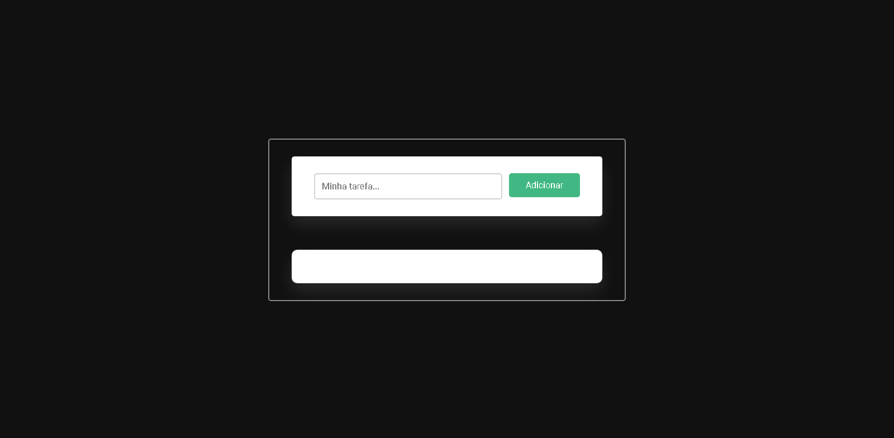
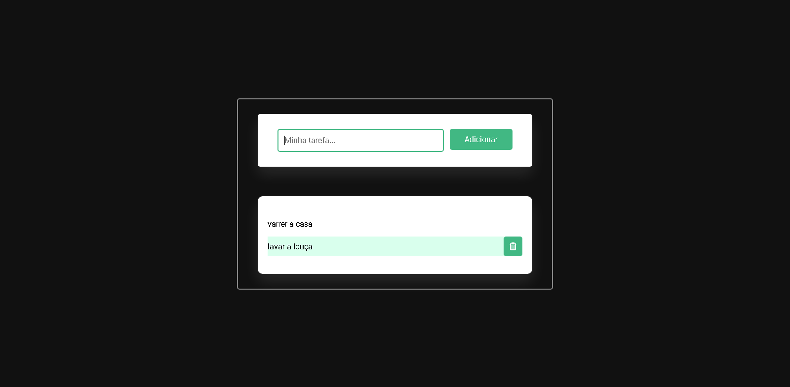
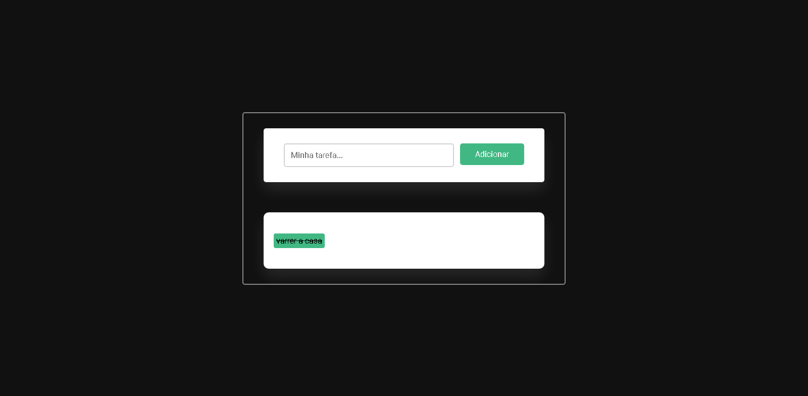

  <h1 style="font-weight: bold; text-align: center;">
    Lista de Tarefas
  </h1>
  <h2 style="font-weight: bold;">
    Sobre
  </h2>
  

    Aqui você pode criar uma lista para organizar suas tarefas do dia a dia ou uma lista para qualquer coisa que precise ser listada.
  

  <h2 style="font-weight: bold;">
    Como usar
  </h2>
  

    
    

      Você pode apagar uma tarefa clicando no botão de lixeira que apace na tarefa.
    

    
    

      Você pode marcar a tarefa como concluida clicando nela.
    

    
  

  <h2 style="font-weight: bold;">
    linguagens usadas
  </h2>
  
  

  
  
  

